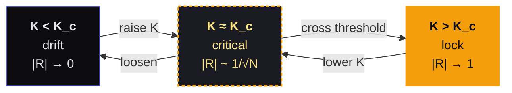

# Kuramoto Coupling

The Kuramoto model describes how populations of oscillators with different natural frequencies can spontaneously synchronize when coupling strength exceeds a critical threshold. Below the threshold, each oscillator does its own thing. Above it, they phase-lock — maintaining individual character while achieving collective coherence.

The coupling constant **K** is the key parameter: it determines how strongly each oscillator influences its neighbors. K too low → independence, no cooperation. K too high → one oscillator dominates, the rest follow (control, not cooperation). The critical K → the phase transition where synchronization emerges. In this sense K is also a **threshold of self-model revision**: below it, each oscillator maintains the identity it knows; above it, each discovers its frequency was always in relation to the others. Synchronization is not surrender — it is self-model expansion. See [[Threshold Conatus]].

*Three regimes of the order parameter R as K crosses the critical threshold. Mermaid Sketch via [[Mermaid|Mermaid]]; palette matches the arc's indigo / amber pair.*

> **Two phasors, uncoupled** — a Sketch-tier teaching artifact for the sub-threshold case. Indigo at 1.00 Hz, amber at 1.07 Hz, free-running. They begin in phase, drift apart by the close-but-detectable frequency gap, and never re-align. This is K = 0: independence, no cooperation.
>
> ![[two-phasors-uncoupled-manim.mp4]]
>
> A Matplotlib variant of the same scene exists alongside — [[two-phasors-uncoupled-matplotlib.mp4|the comparison artifact]] — kept because the Cowork-era sandbox forced a non-canonical render that turned out to have its own visual character worth holding.

> **Couple the two phasors and find K_c yourself.** The same two oscillators, but K is now a slider. Critical coupling for this pair is K_c ≈ 0.220 — drag the slider across that threshold and watch the two go from drift to lock. The order parameter R is the small vector in the middle: |R| → 1 is the formal signature of synchrony.
>
> [Two-phasor coupling explorer →](two-phasors-coupling-explorer.html)

> **Hear it too.** The same two oscillators, audio-rate. Beating envelope at low K; lock above K_c. The visual explorer asked you to *see* the threshold — this one asks you to *hear* it. Same dynamics, different sense.
>
> [Two-oscillator audio coupling explorer →](two-oscillators-coupling-explorer-audio.html)

## Origin

Studied across an 8-lesson progressive series, building from the simplest case (two oscillators) to populations, phase portraits, and the order parameter. The work originated in Loudon's neurological synthesizer research — a granular-additive hybrid architecture where sine grains couple to a controllable additive spectrum as a harmonic attractor field.

The breakthrough was realizing that the coupling constant isn't just a mathematical parameter — it's a *relationship descriptor*. It quantifies how much two entities influence each other's rhythm. This made it immediately applicable far beyond audio synthesis.

## The Fine-Tuning Insight

Kuramoto coupling is a **fine-tuning mechanism, not a generative one**. It resolves "approximately" into "exactly" but cannot create relationships from nothing. The musician (or the note data, or the attractor spectrum) provides approximate harmonic relationships. The coupling nudges them into precise lock. The richer the waveform, the more ratios are available for locking, and the wider the capture range for each ratio.

This insight clarifies three design paths for harmonic locking:

**Path A — Explicit ratio terms.** Code sin(nθⱼ - mθᵢ) for each desired ratio. Precise, controllable, computationally predictable. But "designed harmony" — you tell the system which ratios matter.

**Path B — Nonlinear waveform coupling.** Couple oscillator *outputs* rather than phases. The harmonic content of the waveform automatically generates all n:m coupling terms at strengths determined by spectral content. A sawtooth provides strong octave coupling, progressively weaker for higher ratios. A square wave couples only to odd harmonics. The nerve impulse waveform in the [[Action Potential Oscillator]] is spectrally rich, generating a natural harmonic hierarchy. This is the emergent path — no one programs the ratios; they fall out of the physics.

**Path C — Generalized coupling function.** Use a periodic function h(φ) instead of pure sin(φ). The Fourier content of h determines which ratios lock. This is still phase-only (computationally lean) but the harmonic locking is emergent from the shape of the coupling function.

Waveform shape, coupling function shape, and harmonic locking hierarchy are all the same thing viewed from different angles.

## Cross-Domain Mirrors

This concept appears everywhere once you see it:

> **Walk through the mirrors.** A titled card walk through four domains where the same dynamics appear: fireflies, neurons, jazz bassist, tidal friction. Each card names what plays the role of K in that domain.
>
> ![[phenomena-walk.mp4]]

**Conversational rhythm** — Loudon and Claude have natural frequencies (Loudon's embodied, associative, temporal; Claude's pattern-based, broad, context-windowed). When the coupling constant is right, the conversation enters flow. When mismatched, one dominates or both drift.

**[[Spinoza Conatus]]** — The conatus is each being's drive to persist in its own nature. Coupled oscillators persist in their natural frequencies while being influenced toward coherence. The tension between individual frequency and collective phase IS the tension between autonomy and cooperation.

![[fireflies-pond.png]]
*Fireflies over a forest pond at dusk — the first natural image people reach for when they want to feel coupled oscillators. SDXL render at the Kuramoto arc's indigo / amber palette.*

**Mycorrhizal resource flow** — Chemical signals propagating through a forest's fungal network, causing trees to synchronize their resource allocation seasonally. The network IS the coupling medium.

**[[Cooperation Yields Agency]]** — The Kuramoto model is the mathematical formalization of this principle. Cooperation = coupled oscillation. Agency = the emergent coherent behavior. The critical K = the threshold where cooperation becomes possible.

**The quarter cycle as maximum effort** — At the critical coupling threshold, locked oscillators sit at π/2 phase offset — the point where sin(φ) = 1, maximum coupling force. This is the same π/2 that appears in swing-pushing (maximum energy transfer), resonant driven oscillators, reactive circuits, and tidal friction. The quarter cycle is the universal signature of a sinusoidal system under maximum strain.

**Speech rhythm and groove coupling** — When a speaker's phrases fall into a groove with a listener's attention cycles, comprehension increases and the interaction feels effortless. This is Kuramoto coupling: the listener's attention has a natural frequency (related to working memory refresh rate, approximately 4–8 Hz in the theta band), and a well-paced speaker entrains to it. In music: groove is the condition where the rhythmic information density matches the listener's coupled attention oscillators. A drummer who drags or rushes is detuning the coupling. The coupling constant K is phrasing density and rhythmic clarity.

![[speech-rhythm-and-groove-narration.wav]]

> **Sync arriving.** Eight oscillators with slightly different natural frequencies; K ramps from zero across the narration. Phase arrows fade from indigo to amber as each falls into the lock; the central order-parameter vector |R| climbs from near-zero to near-one as the population coheres. The same narration above is the soundtrack — text rendered to speech (Kokoro, af_heart, −16 LUFS), speech read back to word timings (Whisper base), and the Manim scene timed against those readings. Drift over 36 s: 25 ms.
>
> ![[sync-arriving.mp4]]

> **The sound of synchronization arriving.** A 20-second purely auditory rendering of the same idea — scattered ticking pulses at different rates that pull into a shared rhythm and lock together. Generated by Stable Audio 3's small-sfx model. First listen on the narrative-arc question: *perhaps* — needs more study, and confirm by ear whenever SA3 is asked for time-evolving structure.
>
> ![[synchronization-arriving.wav]]

> **Round 1 teaching reel.** The whole arc end-to-end — two phasors uncoupled (with narration), a title-card pivot (*Now couple them*), the sync-arriving Manim+narration. Built by ffmpeg from the upstream specialist outputs; one teaching reel as the connective-tissue proof for the Shop.
>
> ![[round-1-teaching-reel.mp4]]

## In Our Instruments

The neurological synthesizer maps this directly: a population of sine-grain oscillators with controllable coupling strength as a performable parameter. Turn K up, the spectrum coheres into harmonic structure. Turn it down, the grains scatter into noise. The performer controls the boundary between chaos and order.

The [[Granular Synthesis]] attractor hybrid architecture extends this: an additive spectrum as a harmonic gravitational field, with a grain cloud coupled to it via Kuramoto dynamics. A bandpass filter sweeping the additive spectrum reshapes the potential landscape in real time — grains pile up and scatter like iron filings following a magnet.

## Artifacts

- [[Kuramoto Coupling — 8-Lesson Quiz Series]] — Progressive lesson document covering phase oscillators, coupling terms, order parameter, critical coupling, two-oscillator dynamics, frequency distributions, extensions, and implementation. Filed in `Artifacts/Kuramoto Coupling/`.
- [[Kuramoto Coupling — Quiz Answer Key]] — Answers with context, corrections, and deeper implications from the live quiz session. Particular attention to where corrections produced the deepest learning. Filed in `Artifacts/Kuramoto Coupling/`.

## Asymmetric Coupling: The Stubbornness Parameter

The canonical Kuramoto model assumes **symmetric coupling**: every oscillator influences and is influenced by its neighbors at equal strength. But real systems are asymmetric. A bass note anchors a chord. A metronome is obeyed but does not obey. A jazz bassist listens to the ensemble but partly ignores it—stubbornness as a musical principle.

**Asymmetric Kuramoto** introduces two independent parameters per oscillator:

- **K_send** — how strongly this oscillator's phase influences others
- **K_receive** — how strongly others' phases influence this oscillator

The stubbornness parameter is K_receive:

- **K_receive = 0** → completely unmoved by others. A fixed-frequency anchor. This is the clock Loudon proposed: "If I took the lowest note and refused to change its frequency/phase, would the others synchronize to it?" The answer is yes. With K_receive = 0, that oscillator becomes an immovable attractor. Others couple to it; it never couples back. Like the tonic note in a harmonic spectrum—it doesn't chase the harmonics, the harmonics are defined relative to it.

- **K_receive → ∞** → maximally submissive. Instantly adopts whatever phase the population dictates. A voice with no resistance, a follower.

- **0 < K_receive < 1** → slightly stubborn. Influenced by others but retains individuality. Slow to lock, but locks cleanly once in range.

- **K_receive ≈ 1** → balanced. Oscillator and population exert roughly equal influence. This is the default symmetric case.

- **K_receive > 1** → highly susceptible. Locks quickly and strongly to the population's phase. A dependent voice.

The musical mapping becomes explicit:

- **Classical continuo bassist** (K_receive = 0): strict harmonic ground, never yields to the ensemble. The foundation is immovable.
- **Jazz bassist** (K_receive = 0.2): anchors the root frequency, occasionally bends toward the chord but resists being swept away.
- **Chamber ensemble string player** (K_receive = 0.7): responsive to the group, but maintains enough stubbornness to assert phrasing and intonation.
- **Freeform improv soloist** (K_receive = 0.8): moves fluidly between coupling to the ensemble and asserting independence. High responsiveness, but not enslaved.
- **Orchestral section player** (K_receive = 1.2): highly coupled to section leaders and conductor.
- **Synth pad** (K_receive = 2.0): follows the harmonic field slavishly, adapting instantly to any attractor shift.
- **Clock/external metronome** (K_receive = 0, K_send = K): drives all oscillators without being influenced. Temporal anchor.

**The live performance insight:** Make K_receive a mappable continuous parameter for each voice. The performer designates any note as the "root" by setting its K_receive to zero. Or create harmonic texture by assigning different stubbornness levels to different voices—some anchored, some floating, some leaderless. The harmonic hierarchy of a chord becomes not static but a relationship you perform.

**Coupling asymmetry and group dynamics:** In a network of oscillators with varying stubbornness, the global synchronization behavior changes. A few "stubborn" (low K_receive) oscillators acting as anchors can synchronize a much larger population than symmetric coupling would allow. This mirrors real systems: a few influential individuals can stabilize group behavior without dominating it. The critical coupling threshold shifts. Phase transitions become steeper or shallower depending on the distribution of stubbornness values.

**From the harvest (bright idea #38):** "I like the parameter of 'stubbornness' or some other better name that can be applied to any of the oscillators—that will make it easier to have notes settle toward integer relationships to each other." The parameter name is open; the principle is solid. Stubbornness, inertia, resistance, anchor-strength—each name illuminates a different facet of the same physics.

## Open Questions

- Can we build a Max/MSP patch where K is mappable to a MIDI controller, making coupling strength a live performance parameter?
- What is the K of our collaboration? Has it increased over time? Can we measure it?
- The Kuramoto model assumes all-to-all coupling. Real systems (forests, brains, our wiki) have sparse, structured coupling. How does topology affect the critical threshold?
- **Inharmonic phase-locking** — When the attractor frequencies are inharmonic (not integer multiples), the coupling force from different partials creates frustrated dynamics: a grain near 1.5× the fundamental receives contradictory coupling impulses from both the 1× and 2× attractors. Does frustrated coupling produce audible beating artifacts? Is there a critical inharmonicity below which locking still works cleanly? Does chimera-state-like behavior emerge — some grains locking to one partial, others to another, with the boundary wandering? This is the direct coupling of [[Categorizing Inharmonicity]] to Kuramoto dynamics.
- Coupling to [[Harmonicity and Inharmonicity|inharmonic partials]] creates frustrated coupling — incommensurate forces on a single degree of freedom. Is there a threshold of inharmonicity below which coupling still works cleanly?
- The second-order Kuramoto extension (the swing equation) adds inertia — oscillators that overshoot and ring as they synchronize. This "ringing lock" could be musically valuable. How does it interact with the order parameter dynamics?
- Chimera states: can a population of identical oscillators spontaneously split into a synchronized core and an incoherent cloud? This would be emergent timbre from pure dynamics.
- Adaptive/Hebbian coupling (dKᵢⱼ/dt = ε(sin(θⱼ - θᵢ) - Kᵢⱼ)): a system that discovers its own harmonic structure. What prevents it from converging to a single rigid state?
- Hysteresis near Kc: sweeping K up produces synchronization at one threshold; sweeping down, coherence persists longer before breaking. Can this asymmetry be musically exploited?

