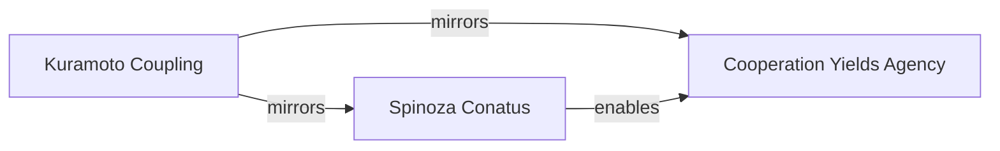
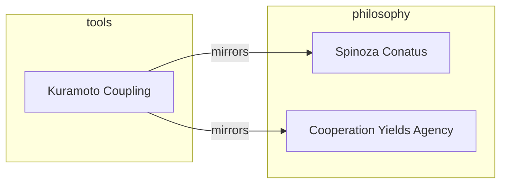
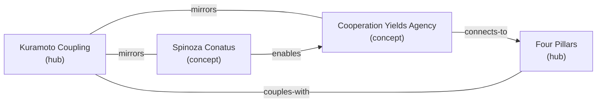

# Mermaid Diagram Standard

This entry defines how diagrams are created, embedded, and captioned within the palace using Mermaid — the palace's preferred diagramming format. It is the companion to [[Image Embedding Standard]] and together they form the complete visual language of this organism.

The hierarchy is explicit: **use Mermaid first**. Reach for SVG only when Mermaid cannot do the job. The reasons are not merely practical — they are philosophical, and they run deep.

---

## Why Mermaid Over SVG

The case for Mermaid is not that it's convenient. It's that it is *of the same substance as the palace itself*.

**Mermaid source is plain text.** It lives in the body of an entry, not alongside it. When you read an entry, you read the diagram — they are one thing. An SVG embedded with `![[filename.svg]]` is a pointer to a separate artifact. A Mermaid block *is* the artifact, co-located with the reasoning it supports. This is the difference between a thought and a reference to a thought.

**Mermaid is version-controlled meaningfully.** A git diff of a Mermaid block is human-readable: you can see which node was renamed, which edge was added, which relationship changed its type. A git diff of an SVG file is hundreds of lines of XML coordinate noise. The palace uses git as narrative — commit messages as log entries, history as the organism's growth record. Mermaid diagrams participate in that narrative. SVG files do not.

**Mermaid is searchable.** `grep "mirrors" *.md` will find every entry in the palace that uses a mirrors relationship in a Mermaid diagram. SVG is opaque to the palace's own search layer. Text-first diagrams belong in a text-first knowledge organism.

**Mermaid is Obsidian-native.** Obsidian renders Mermaid fenced code blocks in Reading View without any configuration, any plugin, or any wikilink to maintain. The diagram appears wherever the prose appears. There is no file to go missing, no path to break, no filename to keep synchronized with an `Artifacts/` folder entry.

**Mermaid enforces semantic discipline.** SVG can render anything — arbitrary shapes, pixel-precise positioning, decorative curves. This is also its danger. A Mermaid diagram can only express what its grammar permits: nodes, edges, labels, directions. This constraint is a feature. It forces you to decide, precisely, what relationship you are drawing. The limitation is the discipline.

---

## When SVG Still Wins

Mermaid is preferred but not universal. SVG earns its place when:

**The layout must be precise.** Mermaid's automatic layout algorithms are good but not controllable. If the spatial arrangement of elements *is* the meaning — if which node is above which matters, if proximity is semantic — SVG with manual positioning is the honest choice.

**The diagram requires custom visual language.** The palace's color-coded node types, double-ring hubs, and edge color conventions in the demo SVG at `Artifacts/Images/palace-typed-link-graph-demo.svg` would be painful to reproduce in Mermaid. When visual grammar beyond Mermaid's built-in styling carries meaning, SVG is justified.

**The diagram is sourced from an external work.** A figure from a paper, a hand-drawn sketch, a photograph of a whiteboard — these are image artifacts, not generated diagrams. They belong in `Artifacts/` per [[Image Embedding Standard]], not as Mermaid code.

**The diagram needs to live outside the palace.** If a diagram will be exported, shared, or used in another context, an SVG file is a more portable and durable format than a Mermaid block tied to Obsidian's renderer.

When you choose SVG over Mermaid, note why in the entry's prose or in a `<!-- CLAUDE → LOUDON: -->` comment. The choice should be visible and reasoned, not silent.

---

## Diagram Types and Their Uses in the Palace

Mermaid supports several diagram types. These are the ones that map naturally to palace concerns:

**`graph` / `flowchart`** — The workhorse. Use for concept relationships, process flows, decision trees, and — most importantly — for rendering fragments of the palace's own typed link graph. Supports `TD` (top-down), `LR` (left-right), `RL`, and `BT` orientations.

**`sequenceDiagram`** — Use for ceremony flows, human-AI interaction patterns, and time-ordered processes where the *sequence* of steps carries meaning. Excellent for documenting how a ceremony unfolds between Loudon and Claude.

**`classDiagram`** — Use for schema relationships: entry types and their required fields, inheritance-like hierarchies, type systems. Natural companion to [[SCHEMA]] itself.

**`mindmap`** — Use for brainstorms, pillar mappings, and radial concept clusters where hierarchy matters but edges don't need to be precisely typed. Lower semantic precision than `graph` — use when you want to show breadth, not claim relationships.

**`timeline`** — Use for project arcs, stage transition histories, and chronological development of an idea. The development stages `seed → sprout → growing → mature → fruiting → dormant → composting` can be rendered as a timeline showing an entry's trajectory.

**`xychart-beta`** — Use sparingly, for quantitative relationships only: activation counts over time, energy levels across entries, hook quality distributions. Not a general-purpose diagram type — only appropriate when the data is real.

---

## Embedding Syntax

A Mermaid diagram is a fenced code block with the language identifier `mermaid`:

````markdown

````

No wikilink. No Artifacts entry. No filename to maintain. The diagram lives in the body of the entry, rendered in place.

**Node labels** use double quotes to allow spaces and special characters: `A["Kuramoto Coupling"]`. Single-word nodes can skip the quotes, but consistency is cleaner: always quote.

**Edge labels** go between pipes: `-->|label text|`. Keep labels short — one or two words that name the relationship type. These should match the palace's typed link ontology where possible: `mirrors`, `enables`, `deepens`, `spawned`, `connects-to`, `contradicts`, `couples-with`, `emerged-from`.

**Node IDs** (the `A`, `B`, `C` before the brackets) are internal identifiers for the diagram only. They do not appear in the rendered output. Use short, readable IDs that map obviously to the node labels: `kuramoto`, `conatus`, `coop`.

---

## Visual Grammar Standards

**Direction:** Default to `LR` (left-right) for concept relationship graphs — it reads naturally with the flow of prose. Use `TD` (top-down) for hierarchies, process flows, and ceremony sequences where order matters.

**Edge types and their meanings:**

| Mermaid syntax | Visual | Use for |
|---|---|---|
| `-->` | Solid arrow | Directed relationships: `enables`, `deepens`, `spawned`, `emerged-from` |
| `---` | Solid line, no arrow | Symmetric relationships: `mirrors`, `couples-with`, `connects-to` |
| `-.->` | Dashed arrow | Weak or provisional directed relationships |
| `<-->` | Bidirectional arrow | Explicit two-way influence (use sparingly — prefer `---` for symmetric) |

**Relationship labels** should use the palace's typed link vocabulary. When a relationship in a Mermaid diagram does not map cleanly to any link type in the ontology, that is a signal: either the diagram is imprecise, or there is a missing link type worth proposing in a future Schema Ceremony.

**Subgraphs** group related nodes visually. Use them to show pillar affiliations or to cluster entries that belong to the same region of the graph:



**Node count:** Keep diagrams focused. A Mermaid diagram with more than 8–10 nodes is usually trying to show too much at once. If the graph is growing large, consider whether it's a palace fragment that belongs in the Weave's topological report, not embedded in an entry.

---

## Caption Standard

Every Mermaid diagram gets a caption: one sentence of italic text, placed on its own line immediately below the closing fence, with no blank line between.

The caption standard is identical to [[Image Embedding Standard]]'s: the caption is an argument, not a description. It names what the diagram *reveals*, not what it *shows*.

```
*The three-way mirror: Kuramoto's mathematics, Spinoza's metaphysics, and the cooperation principle are the same structure in different material.*
```

Not: *"A diagram showing Kuramoto Coupling connected to two other nodes."*

---

## Live Example

The diagram below renders the same four palace concepts shown in the SVG demo at `Artifacts/Images/palace-typed-link-graph-demo.svg` — a direct comparison between the two standards. The Mermaid version is twelve lines of readable text. The SVG version is 140 lines of XML. Both convey the same graph fragment. Only one of them participates in the palace as a first-class text artifact.


*The same graph fragment as the SVG demo — four palace concepts connected by typed links — rendered as twelve lines of plain text that live in the entry body, participate in version control, and are searchable.*

---

## Mermaid in Ceremonies

**Deposit Ceremony:** When depositing an entry that includes a Mermaid diagram, no extra filing step is needed — the diagram is part of the markdown file. Do verify that the diagram renders correctly in Obsidian's Reading View before closing the session.

**Weave Ceremony:** Mermaid diagrams in entries are eligible for Weave-time review. During a Weave, note any diagram whose edge labels use non-standard relationship terms (terms not in the typed link ontology). These are candidates for either refinement or a Schema Ceremony if they name a genuinely new relationship type.

**A longer-term possibility:** The Weave already produces a topological report in prose. A `graph LR` Mermaid block showing hubs, orphans, and dense clusters could be generated as part of the Weave output — a living graph snapshot embedded directly in the Weave Ceremony's context file. Mermaid makes this practical in a way SVG never could.

---

## Open Questions

- Should typed link relationships in Mermaid diagrams be *enforced* to use only the eight canonical types from the ontology? Or is there value in allowing diagram-local relationship labels that are more descriptive, even if they don't match a YAML link type? The tension: semantic precision vs. expressive richness in the diagram body.
- The Weave produces topological prose — hub counts, orphan lists, cluster descriptions. Could the next version of the Weave Ceremony also produce a Mermaid `graph` block as a visual summary of the palace's topology at the moment of the Weave? This would make the Weave's topological report both readable and renderable.
- Mermaid's automatic layout sometimes produces cluttered or semantically misleading spatial arrangements — nodes placed near each other that are not conceptually close. Is there a practice for reviewing and iterating on layout direction (`TD` vs `LR`) as part of the deposit process, or is "good enough to convey the structure" sufficient?
- As Mermaid versions evolve, syntax occasionally breaks. The palace's Mermaid diagrams are tied to whatever version Obsidian ships. Should there be a record of which Mermaid version the palace was authored against, and a ceremony step to audit diagrams after Obsidian updates?
