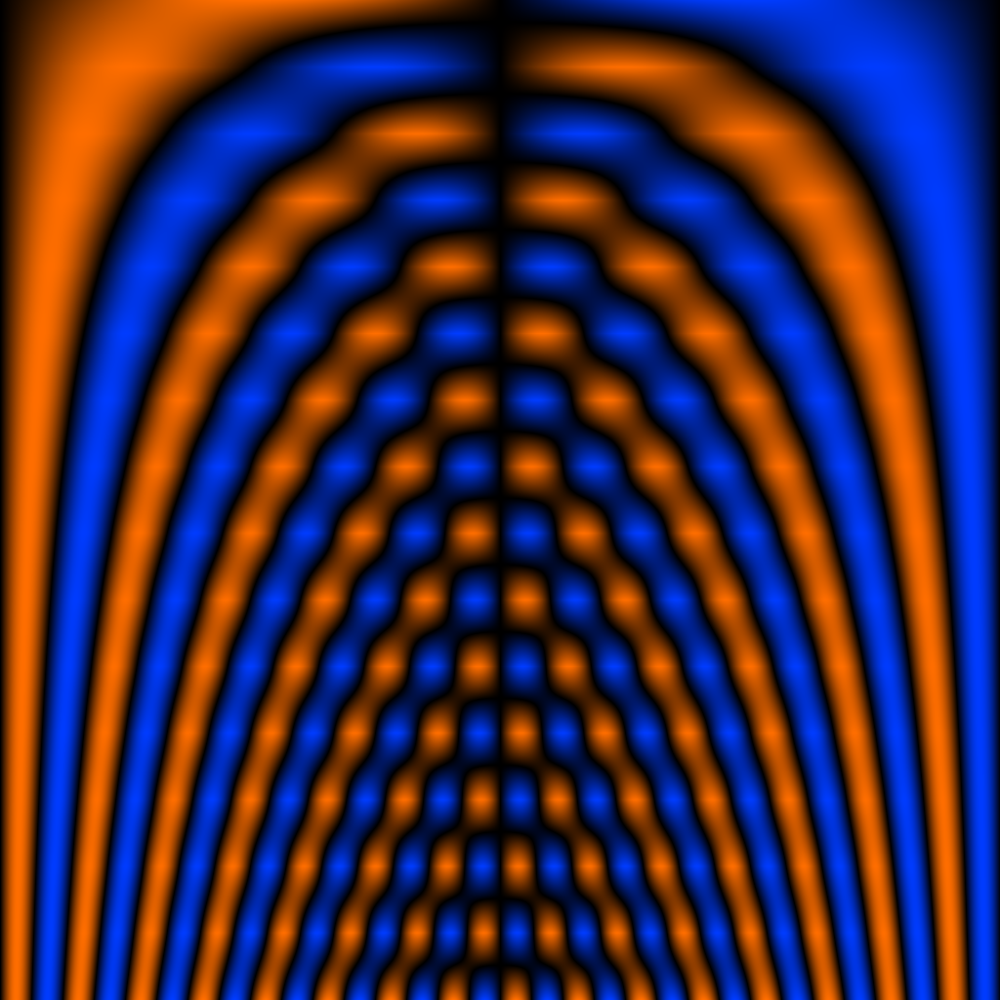

# 01 — Sine Cycle Sweep

Continuous cycle-count sweep, 1 → 16. Y is the harmonic-number axis.

## File

`01_sine_cycle_sweep.wav` — mono, 32-bit float, 48 kHz, 1024 × 1024 = 1048576 samples (21.845 s).
Square wavetable: send `rows 1024` to the `2d.wave~` object before playback so the Y axis is sampled as densely as X.

## What it demonstrates

Pure sine on every row, with cycle count varying continuously from 1 (row 0) to 16 (row 1023). Each row is a crossfade between adjacent integer-cycle sines — every row still starts and ends at zero, so there is no wrap discontinuity. The Y axis reads as a continuous frequency multiplier: at fixed X-phasor frequency f, Y=0 outputs f, Y=0.5 outputs roughly 8f, Y=1 outputs 16f, with smooth interpolation in between.

## Musical use

Hold X = 110 Hz and slowly automate Y from 0 to 1. You hear a clean ramp of pitch spanning four octaves. Run Y as another phasor at audio rate near 110 Hz: the dual pitch creates a structured sideband spectrum — every integer combination m*X + n*Y where the surface has nonzero coefficient. Because the only nonzero coefficients are at (m, 0) for m = 1..16, the spectrum is sparse and harmonic-only.

## Notes

The Y crossfade between integer cycles is the cleanest possible alias-free Y axis: every value of Y produces a row with integer-multiple harmonics only. Aliasing risk comes from the high-cycle rows themselves (row 1023 has 16 cycles in 1024 samples — harmonic 16 — readout aliasing depends on phasor frequency vs sample rate).
