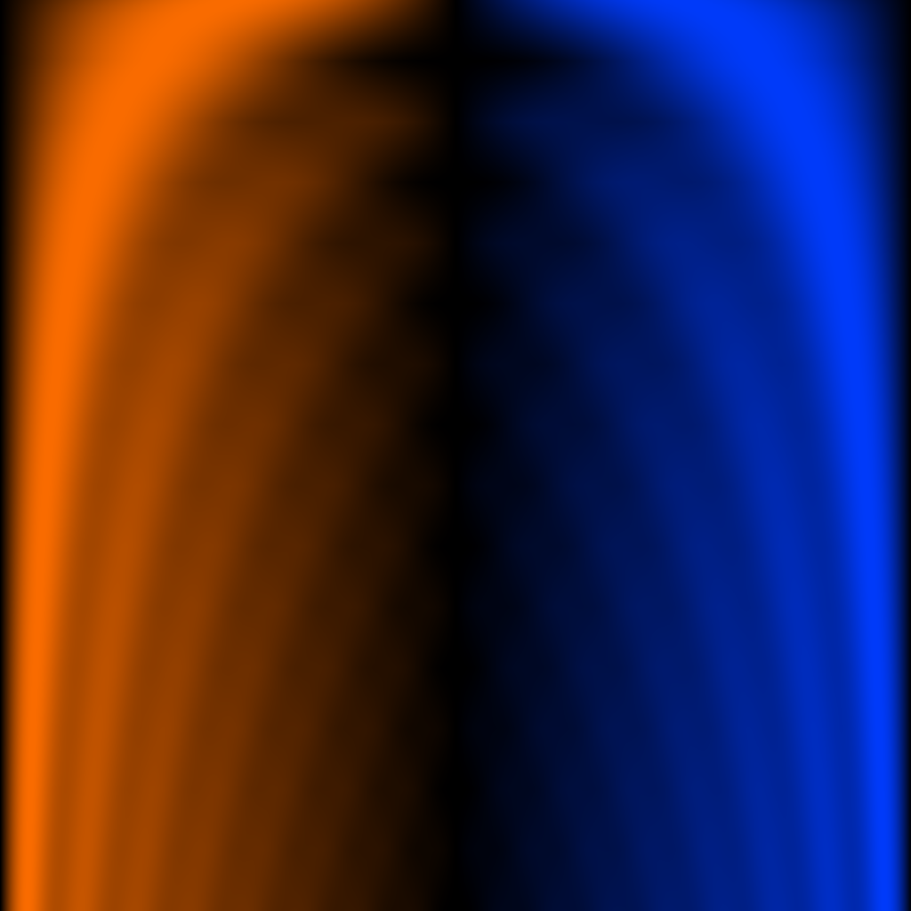

# 02 — Partial Stack Sweep

Saw partials built up smoothly, 1 → 16. Y is harmonic richness.

## File

`02_partial_stack_sweep.wav` — mono, 32-bit float, 48 kHz, 1024 × 1024 = 1048576 samples (21.845 s).
Square wavetable: send `rows 1024` to the `2d.wave~` object before playback so the Y axis is sampled as densely as X.

## What it demonstrates

Sawtooth built up partial-by-partial. Row 0 is a pure sine (1 partial); row 1023 is a 16-partial bandlimited saw. The partial count interpolates continuously across the rows, with adjacent integer-partial counts crossfaded by the fractional part. Y is the harmonic-richness axis.

## Musical use

Sweep Y as a brightness envelope. Hold X at any musical pitch; modulate Y from 0 to 1 with an ADSR for an instant spectral 'opening' gesture (a violin getting bowed harder). Detune two voices by a semitone with different Y trajectories for a chorused saw-pad whose spectral movement is independent of pitch.

## Notes

Logic 1 (direct Fourier coefficient design) at its most literal: we wrote down the partial amplitudes and the wavetable is exactly that. The 1024-row Y resolution lets the brightness envelope feel continuous even at audio-rate Y modulation.
