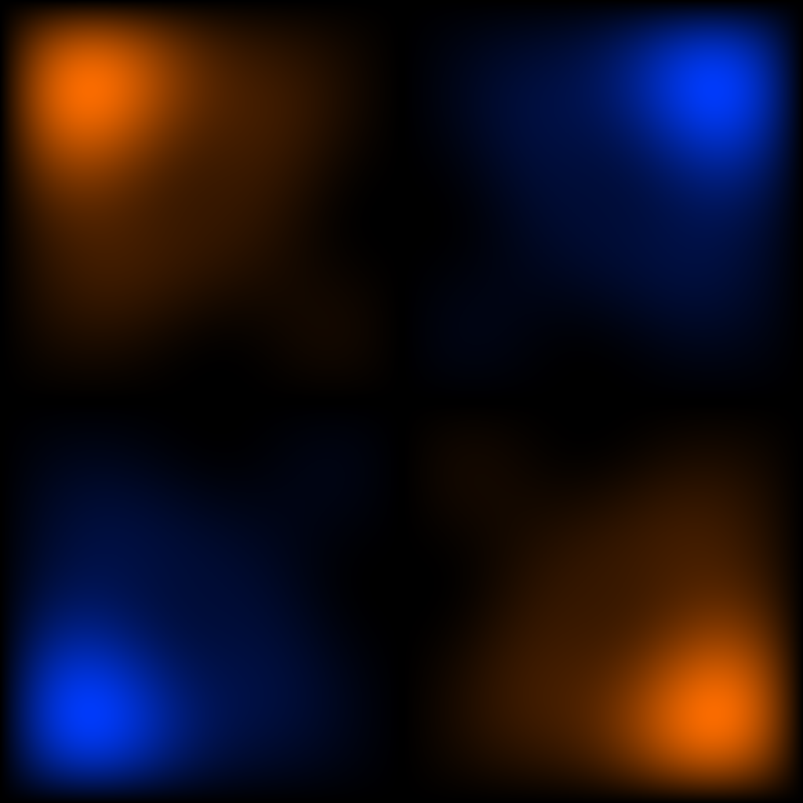

# 10 — Membrane

Rectangular drum-head modes summed at low order. 4-fold symmetric.

## File

`10_membrane.wav` — mono, 32-bit float, 48 kHz, 1024 × 1024 = 1048576 samples (21.845 s).
Square wavetable: send `rows 1024` to the `2d.wave~` object before playback so the Y axis is sampled as densely as X.

## What it demonstrates

Sum of low-order rectangular-drumhead modes sin(m*phi)*sin(n*psi), with amplitudes weighted toward small (m,n) and 4-fold symmetric under phi <-> psi swap. The spectrum is a 2D lattice peaked near the origin — the surface is smooth, with one central mound and gentle outer ripples.

## Musical use

The 'reference timbre' surface — what a drumhead would sound like if you scanned it at audio rate. Try X:Y ratio 3:2 — the closed orbit traces a (3,2) curve through the central mound, producing a stable harmonic tone with strong 2nd, 3rd, 5th partials. Detune to 3:2.01 for the project's headline effect: a quasi-periodic shimmer that no single-oscillator instrument can produce.

## Notes

Logic: direct Fourier (Logic 1). Surface symmetry: 4-fold (D_4 subgroup of T^2 lattice symmetries). This surface is a deliberately conservative starting point — the partials are orderly because the modes are orderly. The other tier-2 surfaces deliberately depart from this in different directions.
