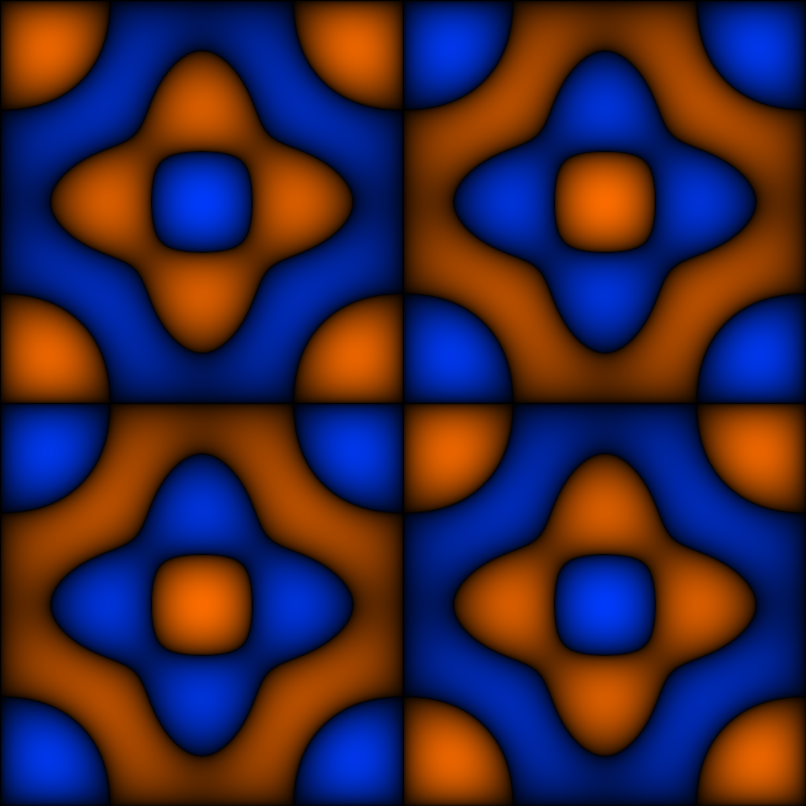

# 11 — Chladni Ghost

Vibrating-plate nodal pattern, sharpened to ridges. 4-fold.

## File

`11_chladni_ghost.wav` — mono, 32-bit float, 48 kHz, 1024 × 1024 = 1048576 samples (21.845 s).
Square wavetable: send `rows 1024` to the `2d.wave~` object before playback so the Y axis is sampled as densely as X.

## What it demonstrates

C(phi,psi) = sin(3*phi)*sin(5*psi) + sin(5*phi)*sin(3*psi), then sharpened by signed-sqrt: W = sign(C) * sqrt(|C|). The result has narrow valleys along the (3,5) Chladni nodal pattern and sharp ridges in between. 4-fold symmetric; the spectrum is a sparse lattice with dominant peaks at (3,5), (5,3), and the difference modes produced by the sharpening nonlinearity.

## Musical use

The ratio knob earns its keep here. At X:Y = 3:5 the scan path closes onto the Chladni nodal lattice itself — the output is a sustained, hollow, bell-like tone. At 5:3 you get the dual orbit, with subtly different spectral weight. Off-rational ratios produce ergodic shimmer with strong harmonic 'attractors' near the integer lattice points — the inharmonicity is *structured*, not noise-like.

## Notes

Logic blend: Logic 1 (Fourier specification of C) plus Logic 2 (the signed-sqrt is a nonlinear operator, equivalent to a p-Laplacian-style shaping). The seventh-surface slot is open in the project — a Chladni Ghost variant with different (m,n) is a candidate.
