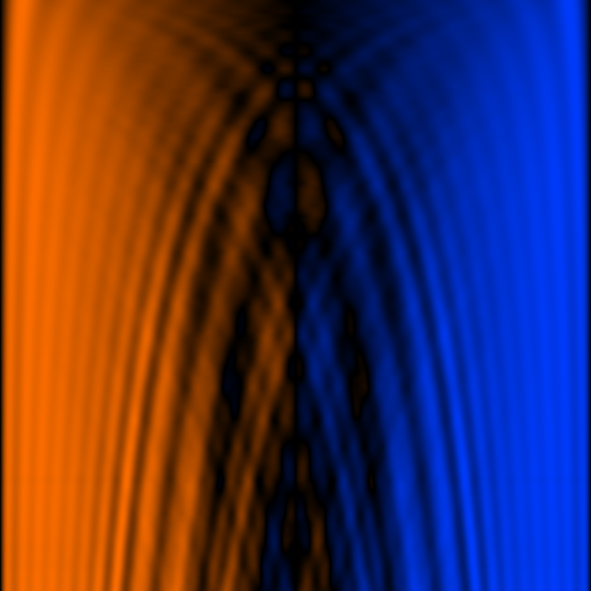

# 13 — Stiff String

Saw whose high partials are quadratically stretched as Y rises.

## File

`13_stiff_string.wav` — mono, 32-bit float, 48 kHz, 1024 × 1024 = 1048576 samples (21.845 s).
Square wavetable: send `rows 1024` to the `2d.wave~` object before playback so the Y axis is sampled as densely as X.

## What it demonstrates

Sawtooth-style row with partials at f_n = round(n * sqrt(1 + B*n^2)) instead of integer multiples. B sweeps from 0 (row 0, clean saw) to 0.06 (row 63, piano-like stiffness). Higher-numbered partials get progressively shifted upward.

## Musical use

The clearest demonstration of the 'inharmonicity is a continuous parameter' thesis. Hold X at a piano-pitch frequency, sweep Y from 0 to 1: the timbre transitions from an idealised sawtooth (zero stiffness) into a piano-string-like spectrum (stretched octaves). Pair with a slowly moving Y phasor and a percussive amplitude envelope and you have the kernel of a piano-substitute synth voice.

## Notes

Caveat: this is the *static-wavetable approximation* of the project's stiffness concept. The richer version is the project description's 'position-dependent velocity warping on the scan path' — that needs runtime phasor-warping logic and produces the partials at exact non-integer frequencies, not rounded. Treat this wavetable as the bandlimited hint of what the dynamic version will sound like.
