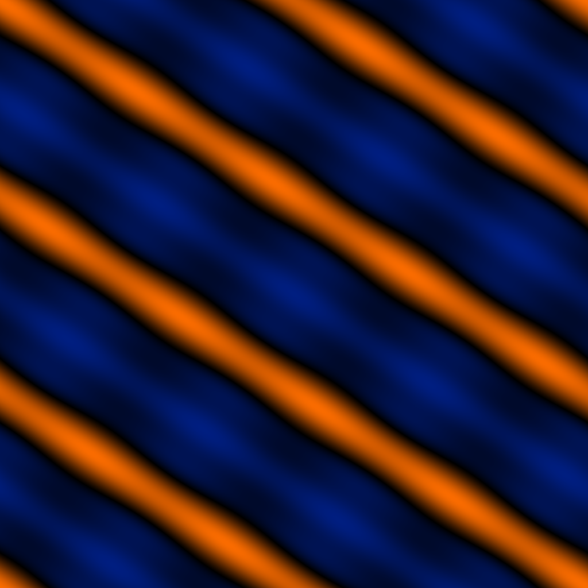

# 14 — Knot Shadow

(3,2) torus-knot-aligned ridges. The ratio gate made visible.

## File

`14_knot_shadow.wav` — mono, 32-bit float, 48 kHz, 1024 × 1024 = 1048576 samples (21.845 s).
Square wavetable: send `rows 1024` to the `2d.wave~` object before playback so the Y axis is sampled as densely as X.

## What it demonstrates

W = cos(2*phi - 3*psi) + 0.45 cos(2*(2*phi-3*psi)) + 0.25 cos(3*(2*phi-3*psi)) + 0.15 cos(3*phi + 2*psi). The first three terms are constant along (3,2) torus knots — so a scan path with X:Y = 3:2 traces a level set of the surface. The fourth term breaks pure constancy and gives the surface a small orthogonal modulation.

## Musical use

This is the surface that proves the project's central design fact: the ratio of scan rates is the inharmonicity gate. Set X:Y = 3:2 exactly: you should hear a sustained, near-pure tone whose pitch is X/3 = Y/2. Detune to 3.0:2.01 — the closed orbit opens into a Kronecker flow that drifts across the surface, sweeping the small orthogonal modulation in and out. The detune amount controls the rate of drift; the surface controls the texture of what you hear during the drift.

## Notes

Logic 1 again, but designed *for* a particular trajectory rather than a particular spectrum — a small but important shift in design intent. Other (p,q) variants are natural follow-ups — a (5,2) knot shadow would unlock different tonal territory.
