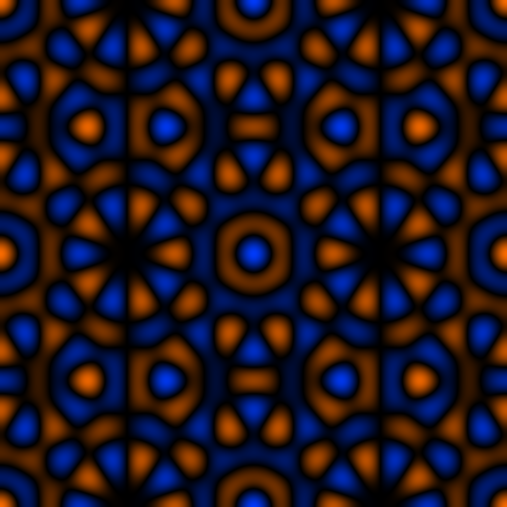

# 15 — Penrose Lattice

5-fold quasicrystal approximation via cut-and-project sum.

## File

`15_penrose_lattice.wav` — mono, 32-bit float, 48 kHz, 1024 × 1024 = 1048576 samples (21.845 s).
Square wavetable: send `rows 1024` to the `2d.wave~` object before playback so the Y axis is sampled as densely as X.

## What it demonstrates

Approximate 5-fold-symmetric surface via the cut-and-project recipe: sum of five cosines along directions 0, 72, 144, 216, 288 degrees, with each direction's spatial frequency rounded to the nearest integer torus mode (K=11). True 5-fold symmetry is impossible on T^2, so the rounding produces a structured but quasi-aperiodic appearance — local 5-fold star clusters that don't tile periodically.

## Musical use

The most exotic of the catalog. The spectrum has its strongest peaks at five distinct (m,n) lattice points arranged near a circle of radius K — meaning at any scan ratio, five intense partial families compete. There is no 'home' rational ratio where the orbit closes onto a clean attractor; every ratio you choose places the orbit in some relation to all five star directions simultaneously. Sweep the ratio slowly and listen for the timbre cycling through five 'preferred' colours.

## Notes

This surface is the catalog's clearest argument for why the project framing is needed: a 1D wavetable cannot represent a 5-fold structured spectrum at all. The 5-fold symmetry is intrinsically 2D. A future variant could increase K (sharper 5-fold appearance, but more aliased) or use proper higher-dimensional cut-and-project rather than the angular approximation.
