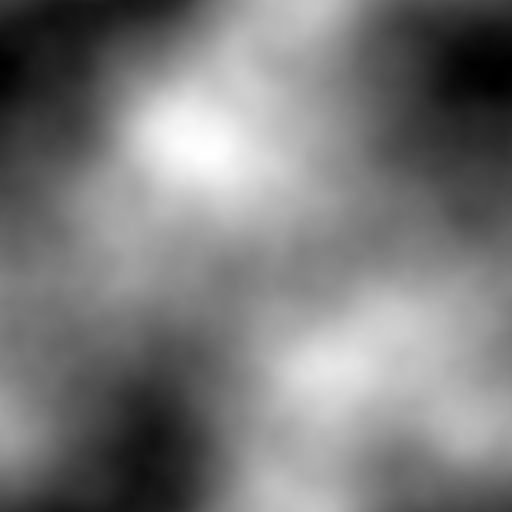

# 17 — Matérn Field

Logic 4 (random fields). A seeded realization of a Matérn Gaussian field synthesized directly on the integer torus lattice. Warm, smooth, statistically specified rather than hand-drawn.

## File

`17_matern_field.wav` — mono, 32-bit float, 48 kHz, 1024 × 1024 = 1 048 576 samples (≈ 21.85 s). Send `rows 1024` to `2d.wave~` before playback.

## What it demonstrates

Fourier coefficients are drawn with random complex phase and amplitude `sqrt(S(k))` where `S(k) = (2ν/ℓ² + 4π²|k|²)^-(ν+1)` is the 2D Matérn power spectral density (`ν = 1.5`, `ℓ = 0.55`). The field is bandlimited at `|k| < 48` so it stays torus-clean. Every realization with this seed produces the same surface; changing the seed produces a different surface with the *same statistical character*. This is the design language's "statistics, not content" move made literal — the surface designer specifies how the spectrum decays and how rough the field is, then nature picks the rest.

## Musical use

Because the spectrum is dense and isotropic (every mode populated, amplitude falling smoothly with `|k|`), the output is rich at any X:Y ratio without any single ratio being "the home ratio." Use as a noise-textured pad whose grain feels acoustic rather than synthetic — the smoothness parameter ν controls how "smeared" vs "grainy" the texture sounds. Sweep X:Y around an irrational like the silver ratio (1:√2 ≈ 1:1.414) for a slowly evolving wash whose timbral fingerprint never repeats over the ~21 s buffer.

## Notes

Logic: random fields (Logic 4). Sibling surfaces in the 2026-06-06 expansion: [[16 — Kuramoto Bloom]] (Logic 3) and [[18 — Fisher Ridge]] (Logic 5). The seed (`20260606`) is preserved in `build_seventh_candidates.py` so this exact realization is reproducible; a future variant could expose `ν`, `ℓ`, and seed as catalog axes producing a Matérn *family* rather than a single member.
