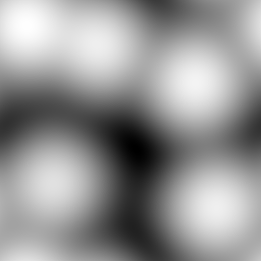

# 18 — Fisher Ridge

Logic 5 (information geometry). The surface *is* the log-likelihood of a five-mode von Mises mixture on T². The ridges are the high-Fisher-information seams where neighboring modes hand off.

## What it demonstrates

Each of five von Mises components is centered on a point on the torus with concentration `κ = 2.2`; the surface is the log-sum-exp stack of those components. Where two components have nearly equal likelihood the surface forms a saddle ridge — those ridges are the Fisher-information seams, the places where small parameter changes produce the largest change in the model's prediction. Geometrically: the surface is the statistical manifold's terrain, and the scan reads the terrain at audio rate.

## File

`18_fisher_ridge.wav` — mono, 32-bit float, 48 kHz, 1024 × 1024 = 1 048 576 samples (≈ 21.85 s). Send `rows 1024` to `2d.wave~` before playback.

## Musical use

The surface has five distinct "mounds" of high amplitude separated by sharp ridges. Scan ratios that route the orbit *through* a ridge (orbit-crossing-seam events) produce snap transitions in the output — the spectrum jumps as the orbit crosses from one mode's basin into another. Set X:Y to a slow irrational and the snaps come at quasi-random intervals; set X:Y to a closed rational that visits all five basins and the snaps repeat as a rhythmic motif. The most "compositional" surface in the catalog — its high points are events, not steady states.

## Notes

Logic: information geometry (Logic 5) — the most radical departure from physical intuition in the design language, and the natural bridge to differentiable-DSP/learned-manifold synthesis (the *Crystal* in the project's Lost Branches). Sibling surfaces in the 2026-06-06 expansion: [[16 — Kuramoto Bloom]] (Logic 3) and [[17 — Matérn Field]] (Logic 4). Future variants could increase the number of components, vary κ, or learn the component centers from a target audio corpus — making the surface itself a trained object.
